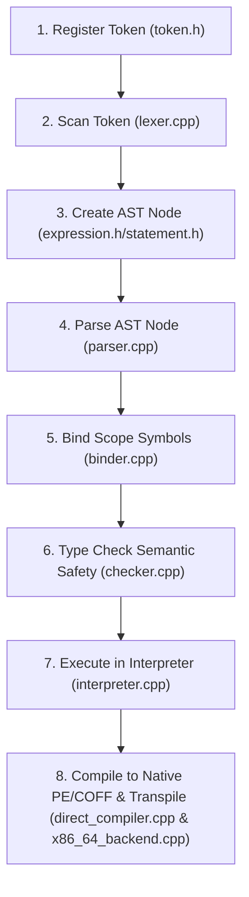

# Developer's Guide: Implementing New Syntax in X-Lang

This guide outlines the precise architectural steps, implementation skeletons, and verification protocols to integrate a new syntax feature into X-Lang. It ensures that both the **native compiler backend** and the **AST interpreter** remain perfectly in sync, with neither lagging behind as a second thought.

---

## 1. The 8-Step Grammar Pipeline

When introducing a new keyword, operator, expression, or statement, you must update the codebase in the following order:



---

## 2. Comprehensive Implementation Skeleton: Step-by-Step

Let us take a concrete example: introducing a **`for` loop** (`ForStmt`). Below are the exact code updates and structures required in each file.

### Step 1: Define the Token
*   **File**: `src/x-lang/frontend/lexer/token.h`
*   Add the token type to the `XTokenType` enum:
    ```cpp
    enum class XTokenType {
        // ...
        For, // Keyword
        // ...
    };
    ```

### Step 2: Lexing (Scanning) the Syntax
*   **File**: `src/x-lang/frontend/lexer/lexer.cpp`
*   If your syntax introduces a new keyword (e.g., `for`), register it in the inverse keyword mapping inside the target language's syntax JSON configuration (e.g., `src/x-lang/frontend/config/x.json`), or handle it dynamically if it's a structural symbol.
*   For symbols (like `..` for ranges), add matching rules to `Lexer::tokenizeSymbolOrOperator()`.

### Step 3: Define the AST Node
*   **Files**: `src/x-lang/frontend/parser/ast/statement.h` & `statement.cpp`
*   **Memory Rule**: Do not use smart pointers (`std::shared_ptr` or `std::unique_ptr`) for ownership. Use raw pointers (`StmtPtr` and `ExprPtr`) allocated inside X-Lang's custom memory `Arena`.
*   **statement.h**:
    ```cpp
    class ForStmt : public Statement {
    public:
        ForStmt(const Token& varName, ExprPtr startExpr, ExprPtr endExpr, StmtPtr body);
        ~ForStmt() = default;

        const Token& getVarName() const;
        const ExprPtr& getStartExpr() const;
        const ExprPtr& getEndExpr() const;
        const StmtPtr& getBody() const;

    private:
        Token varName_;
        ExprPtr startExpr_;
        ExprPtr endExpr_;
        StmtPtr body_;
    };
    ```
*   **statement.cpp**:
    ```cpp
    ForStmt::ForStmt(const Token& varName, ExprPtr startExpr, ExprPtr endExpr, StmtPtr body)
        : varName_(varName), startExpr_(startExpr), endExpr_(endExpr), body_(body) {}

    const Token& ForStmt::getVarName() const { return varName_; }
    const ExprPtr& ForStmt::getStartExpr() const { return startExpr_; }
    const ExprPtr& ForStmt::getEndExpr() const { return endExpr_; }
    const StmtPtr& ForStmt::getBody() const { return body_; }
    ```

### Step 4: Parse the Syntax Node
*   **Files**: `src/x-lang/frontend/parser/parser.h` & `parser.cpp`
*   **Memory Rule**: Allocate the AST node dynamically using `Arena::alloc<T>()`.
*   **parser.cpp**:
    ```cpp
    StmtPtr Parser::parseForStatement() {
        consume(XTokenType::For, "Expect 'for' to start loop.");
        Token varName = consume(XTokenType::Identifier, "Expect variable name in for loop.");
        consume(XTokenType::Colon, "Expect ':' after loop variable.");
        
        ExprPtr startExpr = parseExpression();
        consume(XTokenType::DotDot, "Expect '..' range operator.");
        ExprPtr endExpr = parseExpression();

        StmtPtr body = parseStatement();
        
        // Zero-copy sequential allocation in Arena
        return Arena::alloc<ForStmt>(varName, startExpr, endExpr, body);
    }
    ```
*   Integrate `parseForStatement()` into `Parser::parseStatement()`:
    ```cpp
    StmtPtr Parser::parseStatement() {
        if (match(XTokenType::For)) {
            return parseForStatement();
        }
        // ...
    }
    ```

### Step 5: Symbol Binding & Scope Checking
*   **File**: `src/x-lang/frontend/semantics/binder.cpp`
*   Ensure variables declared by the syntax (like the loop index `i`) are registered in the active scope.
    ```cpp
    void Binder::bindFor(ForStmt& stmt) {
        bind(stmt.getStartExpr());
        bind(stmt.getEndExpr());

        beginScope();
        // Define loop variable inside loop body scope
        symbolTable_.define(stmt.getVarName().getValue(), "int"); 
        bind(stmt.getBody());
        endScope();
    }
    ```
*   Map it inside `Binder::bind(StmtPtr stmt)`:
    ```cpp
    if (auto s = dynamic_cast<ForStmt*>(stmt)) {
        bindFor(*s);
    }
    ```

### Step 6: Type Safety Verification (Semantic Analysis)
*   **File**: `src/x-lang/frontend/semantics/checker.cpp`
*   Check that expressions resolve to the expected types and report diagnostics if validation fails.
    ```cpp
    bool TypeChecker::checkFor(ForStmt& stmt) {
        if (!check(stmt.getStartExpr()) || !check(stmt.getEndExpr())) return false;

        std::string startType = getExprType(stmt.getStartExpr());
        std::string endType = getExprType(stmt.getEndExpr());

        if (startType != "int" || endType != "int") {
            error(stmt.getVarName(), "Loop range boundaries must resolve to 'int'.");
            return false;
        }

        // Push loop variable to checking scope
        typeEnv_.define(stmt.getVarName().getValue(), "int");
        bool bodyOk = check(stmt.getBody());
        typeEnv_.pop();
        
        return bodyOk;
    }
    ```

### Step 7: AST Interpretation (The Interpreter)
*   **File**: `src/x-lang/backend/interpreter/interpreter.cpp`
*   **Rule**: The interpreter runs the code *directly* by visiting the AST statements.
    ```cpp
    void Interp::execFor(const ForStmt& stmt) {
        Val startVal = eval(stmt.getStartExpr());
        Val endVal = eval(stmt.getEndExpr());

        if (!holds_alternative<double>(startVal) || !holds_alternative<double>(endVal)) {
            throw runtime_error("Loop ranges must evaluate to numbers.");
        }

        int start = static_cast<int>(get<double>(startVal));
        int end = static_cast<int>(get<double>(endVal));

        // Setup loop scope
        auto loopEnv = make_shared<Env>(env_);
        
        for (int i = start; i <= end; ++i) {
            loopEnv->def(stmt.getVarName().getValue(), static_cast<double>(i), "int");
            execBlock({stmt.getBody()}, loopEnv);
        }
    }
    ```
*   Route it in `Interp::exec(const StmtPtr& stmt)`:
    ```cpp
    } else if (auto s = dynamic_cast<ForStmt*>(stmt)) {
        execFor(*s);
    }
    ```

### Step 8: Native Compiler Code Generation
*   **Files**: `src/x-lang/backend/native/codegen/pe/direct_compiler.cpp` & `x86_64_backend.cpp`
*   **Rule**: Emit raw machine instruction loops matching the interpreter behavior exactly.
*   **direct_compiler.cpp**:
    ```cpp
    void DirectCompiler::compileFor(ForStmt* stmt) {
        // 1. Compile start/end limits and push variables onto caller stack frames
        compileExpr(stmt->getStartExpr());
        // ... (Emit x86 MOV / PUSH instructions to loop variables)
        
        // 2. Define branch labels for loop conditions & jumps
        uint32_t startLabel = labelIndex_++;
        uint32_t endLabel = labelIndex_++;

        emitLabel(startLabel);
        
        // 3. Emit loop boundary condition comparison (e.g. cmp, jge to endLabel)
        // ...
        
        // 4. Compile loop body statements
        compileStatement(stmt->getBody());
        
        // 5. Emit increment operation (e.g. add loopVar, 1)
        // 6. Jump back to startLabel and close loop
        emitJump(startLabel);
        emitLabel(endLabel);
    }
    ```

---

## 3. The 3 Synchronization Commandments (No Gaps Permitted)

To prevent the compiler and interpreter from drifting apart, strictly adhere to these three system rules:

### I. Double-Ended Semantic Parity
For any expression, operation, or block escape sequence, the output of **`cf.exe x interpret <file>`** and the native binary generated by **`cf.exe x compile <file>`** must match exactly down to the last byte. No runtime conversions, numeric promotions, or implicit type alignments may differ between interpreted variables and native memory layouts.

### II. Unified Diagnostic Enforcement
If the parser, binder, or type checker finds a semantic syntax error, they must write to the unified `codeframe::DiagnosticEngine::getInstance()` rather than printing directly to `stdout`/`stderr`. This keeps error messaging completely uniform between command-line compilation passes and real-time IDE compiler parsing.

### III. The Arena Cleansing Protocol
All AST allocations (`Expr*` and `Stmt*`) must be registered on the custom `Arena` using `Arena::alloc<T>()`. Destructors are recorded automatically and run sequentially upon `Arena::clearAll()` inside `xcommands.cpp`. Never call `delete` or manage AST nodes manually.

---

## 4. Immediate Testing and Validation Workflow

As soon as you implement the syntax:
1.  **Draft a Test Case**: Place a `.x` file using the new syntax in `src/tests/x-lang/projects/x/new_feature.x`.
2.  **Verify Parity**: Run `.\build\debug\codeframe.exe x test`. The test runner will automatically run both the **interpreter** and the **native compiler** and check for exact stdout character matches.
3.  **Run Permutations Matrix**: Run `python scripts/combinatorial_harness.py` to confirm that the code maps cleanly and executes correctly across C++, C#, Java, Pascal, Python, Rust, TypeScript, Zig, and X without regression!
