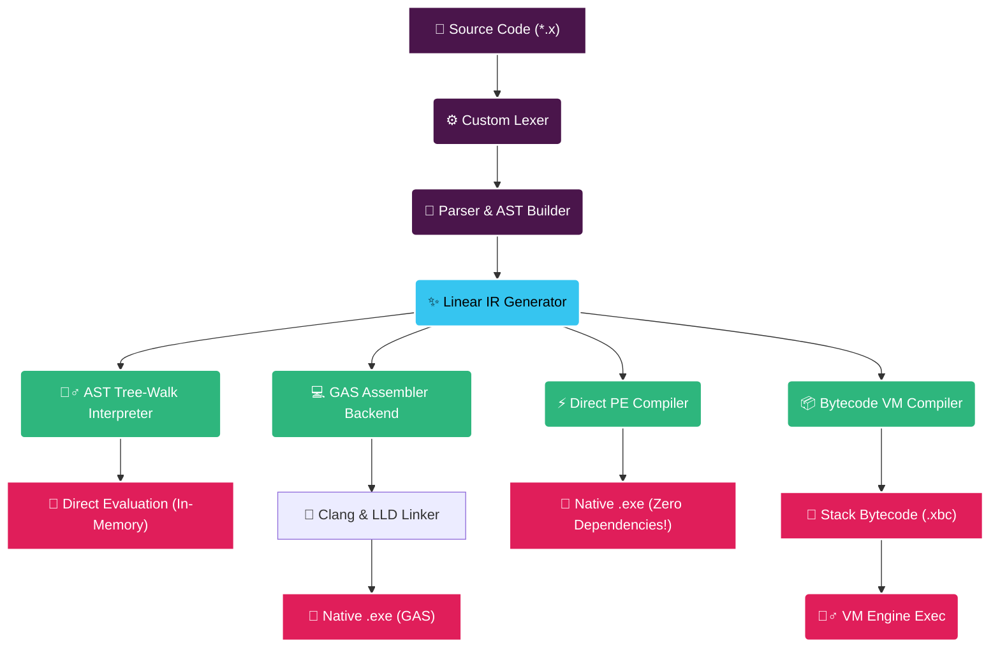

# ⚡ x-lang: The Universal Compiler Core

Welcome to **x-lang**, CodeFrame's revolutionary early-stage compiler frontend and execution engine. 
Why master five different languages when you can configure a single, universal system? x-lang is built from the ground up to prove that one elegant toolchain can compile, transpile, and execute everything.

:::important
⚠️ **Status: Active Prototype / Early Access**  
x-lang is currently in active development. Parity is actively tested across all compilation targets (AST, PE, GAS, VM, and C++ transpilation). Use with caution and massive curiosity!
:::

---

## 🗺️ The x-lang Compilation Matrix
How does code go from raw text to lightning-fast machine code? Here is the complete visual pipeline of the **x-lang engine**:



---

## 🚀 Execution Modes

You can control x-lang with three distinct execution profiles directly inside CodeFrame:

import Tabs from "@theme/Tabs";
import TabItem from "@theme/TabItem";
import CodeBlock from "@theme/CodeBlock";

<Tabs
  defaultValue="interpret"
  values={[
    { label: "🏃‍♂️ 1. Interpret Mode", value: "interpret" },
    { label: "🛠️ 2. Compile Mode", value: "compile" },
    { label: "🔄 3. Transpile Mode", value: "transpile" },
  ]}
>
  <TabItem value="interpret">
    <p>Evaluates and runs your source file instantly via the high-performance AST tree-walk interpreter.</p>
    <CodeBlock language="powershell">
      cf x src/main.x
    </CodeBlock>
    <div style={{ marginTop: '8px' }}>
      <strong>💡 Pro Tip:</strong> Perfect for debugging dynamic scopes, quick testing, and development feedback loops!
    </div>
  </TabItem>
  <TabItem value="compile">
    <p>Lowers the AST into intermediate representation, then triggers code generation to produce native executables.</p>
    <CodeBlock language="powershell">
      cf compile -m=release
    </CodeBlock>
    <div style={{ marginTop: '8px' }}>
      <strong>💡 Pro Tip:</strong> Generates either optimized assembly via Clang, custom bytecode (.xbc) for the VM, or a zero-dependency standalone PE executable!
    </div>
  </TabItem>
  <TabItem value="transpile">
    <p>Source-to-source compilation! Translates x-lang structures into high-performance C++23 source code.</p>
    <CodeBlock language="powershell">
      cf transpile src/main.x
    </CodeBlock>
    <div style={{ marginTop: '8px' }}>
      <strong>💡 Pro Tip:</strong> This allows x-lang projects to be compiled on any platform that has a C++ compiler!
    </div>
  </TabItem>
</Tabs>

---

## ✍️ Language Features at a Glance

x-lang combines the safety of strict types with the speed of low-level compilation. Let's look at the syntax:

```typescript title="src/main.x"
// 1. Defining functions using Return-Type-First style
int calculate(factor: int) {
    return factor * 10;
}

void main() {
    console.log("=== x-lang Core Demo ===");

    // 2. Explicitly typed variables (no 'var' keyword, name-first with colon)
    a: int = 42;
    pi: const float = 3.14159;
    name: str = "CodeFrame Operator";
    active: bool = true;

    // 3. Automated Type Coercion (Clean string concatenation!)
    console.log("Welcome " + name);
    console.log("Constant: " + pi);
    console.log("Boolean Status: " + active);

    // 4. Scoping & Local Block Variables
    if (a > 40) {
        tempValue: int = calculate(a);
        console.log("Calculated output: " + tempValue);
    }
    
    // 5. Dynamic Property Access
    sys.config.user.role = "Admin";
    console.log("Current role: " + sys.config.user.role);
}
```

:::tip
### 🔑 Scoping Rule:
Variable resolution ascends lexicographically from the current block up to the global scope. Reassignment propagates upwards, while new declarations with explicit types or `const` dynamically create variables bound strictly to the *current local scope*.
:::

---

## 🛠️ The Architecture Deep Dive

x-lang isn't a single compiler; it is a **multi-engine powerhouse**:

### 1. Standalone Direct PE Compiler
Windows executables usually require massive SDKs, build tools, or linkers. **Not with x-lang.**
* **`x86_64_encoder`**: Direct machine code binary generation directly from intermediate representation.
* **`pe_writer`**: Standalone PE/COFF generator writing sections, headers, and metadata block-by-block.
* **`linker`**: Creates fully compliant Import Address Tables (IAT) for standard Windows libraries like `msvcrt.dll` completely from scratch.
* **Result**: A fast, independent, native `.exe` with **zero external dependencies**.

### 2. GAS Backend
* Lowered Linear IR is converted directly into clean, standard **GNU Assembler (GAS) `.s`** text.
* CodeFrame leverages its integrated **Clang/LLD toolchain** to quickly compile and link the assembly file into a native binary.

### 3. Stack-Based Bytecode VM
* For instant virtual execution, the compiler lowers the linear IR into a custom virtual instruction set.
* Generates a compact `.xbc` binary.
* Runs on the integrated **x-lang VM Engine**, utilizing clean virtual register files and isolated execution environments.

---

## ⚡ ADHD-Friendly Takeaways: Why x-lang?

* 🏃‍♂️ **Instant Interpreter**: Zero compile lag when developing.
* 📦 **Direct Compiler**: Single-command native compilation with zero host SDK prerequisites on Windows.
* 🔀 **Universal Transpilation**: Generates industry-grade C++23.
* 🤖 **Smart Coercion**: Concatenate strings, numbers, and booleans effortlessly.
* 📂 **Clean Syntax Configuration**: Customizable syntax mapping built straight into the lexer.

:::warning
Keep an eye out for **Phase 2 (Arrays, Structs, Enums)** and **Phase 5 (Pointers, Heap Allocation)** coming very soon!
:::
