## Why CodeFrame Had to Launch Early

I chose to leave behind financial stability to build XtremeStudios and bring CodeFrame to life. This is more than just a project — it’s a commitment to creating something that matters.

Building alone means making trade-offs. ARM64 support was the hardest to set aside for the initial release, but waiting until every feature was perfect would have meant never finding out if CodeFrame is something people actually want.

Launching early is the only way to test that.  
If it resonates, it grows into the tool I believe it can be.  
If not, I’ll take the lessons forward and refocus my skills where they can create the most impact.

---

## Whats Missing

**Platform Support**

- ARM64 (Windows) – planned
- Linux – planned
- macOS – planned

**Planned features**

- Package Manager: broader architecture flags, versioning, publish to CodeFrame
- CodeFrame Config: Handle edge cases and have clear minimal config to start a project.
- Commands: `init` (project converter), `document`, `generate` (schematics), `execute` (one-shot C++)
- VSCode Extension: codeframe manager, in-app docs, scaffold/manage schematics, create your own schematics

:::info ⏳ Ongoing Development
Active work is happening on the **CodeFrame Library** right now.  
Expect frequent updates as we refine the API, improve stability, and add planned features.
:::

---

# CodeFrame Roadmap

The roadmap below shows the sequence of planned releases, with the current work highlighted and future milestones grayed out.

```mermaid
%%{init: {
  "theme":"base",
  "themeVariables": {
    "primaryColor":"#9777ea",
    "primaryTextColor":"#ffffff",
    "lineColor":"#9d9d9e",
    "tertiaryTextColor": "#ffffff"
  }
}}%%
graph TD
alpha("Alpha Release"):::success --> postAlphaRelease1

  subgraph postAlphaRelease1["Post-Alpha Release 1"]
    arm64("ARM64 Support"):::primary
    linux("Linux Support"):::primary
    init("Init Command"):::info
    config("CodeFrame Config"):::warn

    arm64 --> init
    linux --> init
    init --> config
  end

  %% Link postAlphaRelease1 to postAlphaRelease2
  postAlphaRelease1 --> postAlphaRelease2

  subgraph postAlphaRelease2["Post-Alpha Release 2"]
    pkg("Package Manager"):::warn
    generateCmd("Generate Command"):::info
    documentCmd("Documentation Command"):::info
    vscode("VSCode Extension"):::primary

    vscode --> pkg
    vscode --> generateCmd
    vscode --> documentCmd
  end

  postAlphaRelease2 --> postAlphaRelease3

  subgraph postAlphaRelease3["Post-Alpha Release 3"]
    macos("macOS"):::primary
    executeCmd("Execute Command"):::info
    upgradeCmd("Upgrade Command"):::info

    macos --> executeCmd
    executeCmd --> upgradeCmd

  end

  classDef primary fill:#9777ea,stroke:#5a39b8,color:#fff;
  classDef success fill:#2ecc71,stroke:#27ae60,color:#fff;
  classDef warn fill:#f39c12,stroke:#e67e22,color:#fff;
  classDef danger fill:#e74c3c,stroke:#c0392b,color:#fff;
  classDef info fill:#3498db,stroke:#2980b9,color:#fff;

  %% Group (subgraph) styles
  %% Active release = light green highlight
  style postAlphaRelease1 fill:#4e4466,stroke:#9777ea,stroke-width:2px,rx:5px,ry:5px
  %% Planned release = disabled gray
  style postAlphaRelease2 fill:#3e3e43,stroke:#1f1f22,stroke-width:2px,rx:5px,ry:5px
  %% Planned release = disabled gray
  style postAlphaRelease3 fill:#3e3e43,stroke:#1f1f22,stroke-width:2px,rx:5px,ry:5px

```

